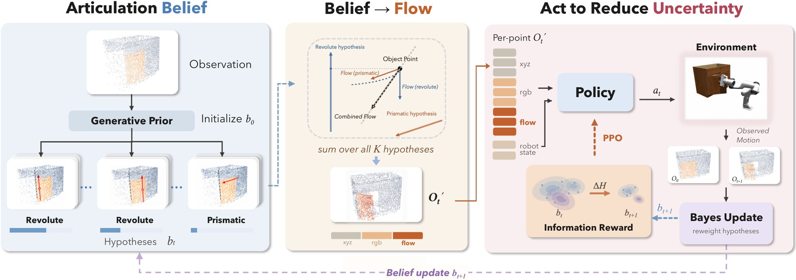

<h1 align="center">
  Learning to Explore Hidden Kinematics for Articulated Object Manipulation
</h1>

<p align="center">
  <a href="https://hiddenkinematics.github.io/">🌐 Website</a> |
  <a href="https://arxiv.org/abs/2609.36553">📖 Paper</a> |
  <a href="https://huggingface.co/datasets/arielyao/ArticuRiddle">🤗 Data</a>
</p>

## Introduction

The kinematics of an articulated object is often ambiguous from vision alone. Interaction resolves
the ambiguity, and active perception methods exploit this by searching for the action that
sharpens a belief over the kinematic parameters at each step. Such greedy search cannot be
extended over a horizon without forward models of the contact and inertial dynamics, which are
themselves unknown. We instead amortize action selection into training.

We maintain a belief distribution over joint type and parameters, initialized from a generative
prior and updated by Bayesian filtering on the observed part motion. To condition the policy on
this belief, we render it as a per-point articulation flow field, the motion that the current
posterior predicts for every point on the object. We train the vision-based policy with
reinforcement learning, rewarding the entropy that each interaction removes from the posterior, so
that informative exploration becomes learned behavior rather than a search at every step.

<p align="center">
  
</p>

## Installation

```bash
# Clone the repository
git clone https://github.com/ariel6905/HiddenKinematics.git
cd HiddenKinematics

# Create conda environment
conda create -n hidkin python=3.8
conda activate hidkin
pip install torch==1.13.1+cu117 --extra-index-url https://download.pytorch.org/whl/cu117

# Install IsaacGym Preview 4, pytorch3d 0.7.3 and pointnet2_ops following their guides, then
pip install -e .
```

## Dataset

### PartManip

Download the cabinet assets and the Franka model from [PartManip](https://github.com/PKU-EPIC/PartManip)
and place them under `assets/` (`val` is PartManip's `valIntra` split; either name works):

```
assets/
├── door/{train,val}/
├── drawer/{train,val}/
└── franka_description/
```

### ArticuRiddle

We introduce ArticuRiddle, a new dataset of 100 articulated objects whose appearance implies the
wrong articulation. Each object is derived from a PartManip asset in one of two ways: the joint is
swapped while the look stays the same (a drawer front that swings, a door that slides), or the
handle is moved or rotated so that it suggests the wrong motion. A policy that trusts appearance
alone is misled, and must interact with the object to find out how it moves. We release ArticuRiddle
on [Hugging Face](https://huggingface.co/datasets/arielyao/ArticuRiddle), with the source PartManip asset of every object.

## Quick Start

### Generate Prior

The articulation belief is initialized from joint hypotheses generated offline with
[NAP](https://github.com/JiahuiLei/NAP). For every asset, sample B hypotheses of the target joint
and save them as a pickle per category, `{asset_name: {"dirs", "score", "piv", "typ"}}`: axis
direction in the object frame, a score (lower is more likely), and, for `--prior_mode nap`, the
pivot normalized to the movable part's bounding box and the joint type (0 prismatic, 1 revolute).
The format is documented in `src/estimation/prior.py`; pass the files with `--prior`.

### Training

```bash
# 1. State teachers
python scripts/train_teacher.py --category door
python scripts/train_teacher.py --category drawer

# 2. Teacher demonstrations with the online articulation flow
python scripts/collect_demos.py --teacher_door <door.tar> --teacher_drawer <drawer.tar> --prior <door.pkl> <drawer.pkl>

# 3. Behavior cloning of the vision-based policy
python scripts/train_bc.py --demo_dirs data/demos/door data/demos/drawer

# 4. DAgger + PPO
python scripts/train_dagger_ppo.py --bc_ckpt <bc.pt> --teacher_door <door.tar> --teacher_drawer <drawer.tar> \
    --prior <door.pkl> <drawer.pkl>
```

DAgger + PPO runs on 3 GPUs (`--launch` sets the launcher, `torchrun` by default).

### Evaluation

```bash
python scripts/evaluate.py --ckpt runs/dagger_ppo/final.pt --bc_ckpt <bc.pt> --prior <door.pkl> <drawer.pkl> --split train val
```

## Project Structure

```
HiddenKinematics/
├── src/
│   ├── envs/           # IsaacGym environment (franka_pose_cabinet_base.py) and utils/
│   ├── algorithms/     # Teacher PPO (pregrasp_ppo/), student DAgger + PPO (dagger_ppo/), backbone (ppo_utils/)
│   └── estimation/     # Articulation belief and flow
├── scripts/            # Training and evaluation entry points
├── configs/            # Environment config and training shards
└── figures/            # README figures
```

## Configuration

The environment (observation, reward, success threshold) is configured in `configs/env.yaml`, and
the DAgger + PPO training shards in `configs/shards.yaml`. Training hyper-parameters are the
script defaults; see `--help` of each script. Two options select variants of the method:

- `--prior_mode {densify,nap}`: how the articulation prior initializes the belief.
- `--dagger_mode {separate,joint}`: how the DAgger and PPO losses are optimized.

## Acknowledgements

Our simulation environment, cabinet assets and teacher-student pipeline build on
[PartManip](https://github.com/PKU-EPIC/PartManip), whose objects come from
[GAPartNet](https://pku-epic.github.io/GAPartNet/) (built on PartNet-Mobility). The articulation prior is sampled from
[NAP](https://github.com/JiahuiLei/NAP), the sparse point-cloud encoder uses
[spconv](https://github.com/traveller59/spconv), and simulation runs on
[NVIDIA Isaac Gym](https://developer.nvidia.com/isaac-gym). We thank all these authors for their
nicely open sourced code and their great contributions to the community.

## Citation

If you find this work useful in your research, please cite:

```bibtex
@misc{liu2026learningexplorehiddenkinematics,
      title={Learning to Explore Hidden Kinematics for Articulated Object Manipulation},
      author={Ruiyao Liu and Boshu Lei and Zhuoyang Pan and Kostas Daniilidis},
      year={2026},
      eprint={2609.36553},
      archivePrefix={arXiv},
      primaryClass={cs.RO},
      url={https://arxiv.org/abs/2609.36553},
}
```
